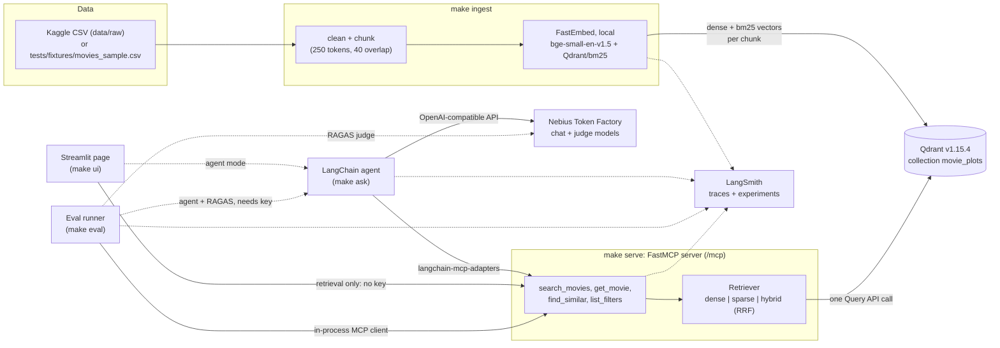
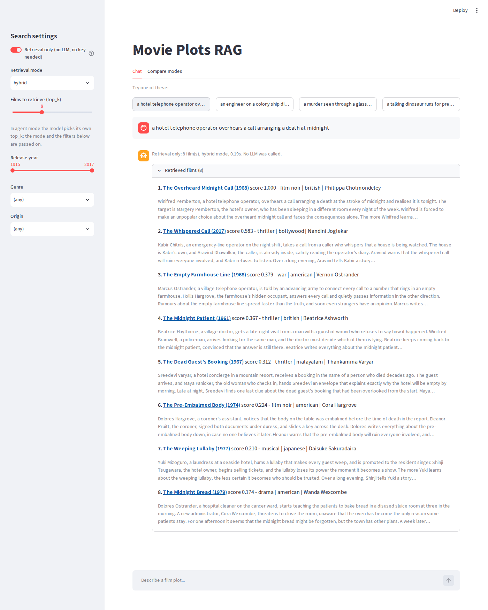

# Movie Plots RAG

A movie-discovery RAG agent that answers fuzzy plot questions ("a heist movie where the crew is betrayed by the
getaway driver") with cited results. Hybrid retrieval (dense + BM25 with RRF) over Qdrant, served through an MCP
server, consumed by a LangChain agent, with a Streamlit test page and a RAGAS evaluation harness.

Everything up to retrieval, the MCP server, the test page and the retrieval metrics runs **without any API key**. Only
the LLM answers and the RAGAS scores need one (see [What needs a key](#what-needs-a-key)).

## Architecture



Solid arrows run without credentials; dashed ones need a key (Nebius) or are no-ops without one (LangSmith). Design
decisions: [`docs/adr/`](docs/adr/README.md) ([Qdrant](docs/adr/001-qdrant.md), [RRF and parameters](docs/adr/002-rrf-and-parameters.md),
[chunking](docs/adr/003-chunking.md), [local embeddings](docs/adr/004-local-embeddings.md)).

## Quickstart (no keys)

Prerequisites: Python 3.12, [uv](https://docs.astral.sh/uv/), Docker with Compose, git, `make`. Ports 6333 (Qdrant),
8000 (MCP server) and 8501 (Streamlit) free. About 64 MB of embedding models are downloaded on first use.

```bash
git clone https://github.com/fsystemweb/movie-plots-rag.git
cd movie-plots-rag
make setup     # uv sync --all-extras --dev (+ pre-commit hooks)
make demo      # starts Qdrant, ingests the synthetic fixture, runs a sample query in dense, sparse and hybrid mode
```

`make demo` ends by printing the sample query (`retrieval.demo_query` in `config.yaml`) answered by all three modes;
`make demo Q="your own plot description"` asks something else. Then:

```bash
make serve     # terminal 1: MCP server on http://127.0.0.1:8000/mcp (needs the demo's Qdrant + data)
make ui        # terminal 2: Streamlit test page on http://localhost:8501, "Retrieval only" mode needs no key
make down      # stop Qdrant (the data stays in the qdrant_storage volume)
```

Other useful commands: `make doctor` (what is configured, what to do next), `make check` (lint, format, mypy strict,
tests with the 80% coverage gate), `make eval && make report` (retrieval metrics and the Results block below).

### What needs a key

| Needs | Variable | Without it |
|---|---|---|
| The agent's answers (`make ask`, the page's agent mode), RAGAS | `NEBIUS_API_KEY` | prints `set NEBIUS_API_KEY — see docs/CREDENTIALS.md` and exits; the page falls back to "Retrieval only"; reports say "pending credentials" |
| The real 35k-film dataset (`make download`) | `KAGGLE_USERNAME`, `KAGGLE_KEY` | prints what to set; `make ingest` uses the synthetic fixture |
| LangSmith traces and experiments | `LANGSMITH_API_KEY`, `LANGSMITH_TRACING` | tracing is a no-op with identical code paths |

The credentials guide (`docs/CREDENTIALS.md`) is coming in PR-11; until then the variable names are in `.env.example`
and the tunables in [`config.yaml`](config.yaml). Development and CI use the synthetic
[`tests/fixtures/movies_sample.csv`](tests/fixtures/README.md); the real dataset and its licence are described in
[`docs/DATASET.md`](docs/DATASET.md).

## Results

The block below is generated by `make report` from the committed `reports/eval_<mode>.json` files and is checked
against them by a test (`tests/unit/test_readme_results.py`): do not edit it by hand, and every figure in it traces to
those files. Regenerate with `make eval && make report` (needs Qdrant: `make up`).

<!-- BEGIN RESULTS (generated by `make report` from reports/eval_<mode>.json; do not edit by hand) -->

Synthetic fixture: 40 questions over 304 indexed chunks (collection `movie_plots`), retrieval depth 8. Hit@k and MRR are over the 30 questions that have a gold film; latency is one in-process `search_movies` call.

| Mode | n | Hit@1 | Hit@3 | Hit@5 | Hit@8 | MRR | Hit@1 (fuzzy plot) | latency p50 (ms) | latency p95 (ms) |
|---|---|---|---|---|---|---|---|---|---|
| dense | 30 | 0.767 | 0.767 | 0.833 | 0.900 | 0.792 | 0.700 | 37 | 61 |
| sparse | 30 | 0.967 | 1.000 | 1.000 | 1.000 | 0.983 | 1.000 | 21 | 22 |
| hybrid | 30 | 0.883 | 1.000 | 1.000 | 1.000 | 0.942 | 0.950 | 34 | 69 |

LLM-backed metrics (the agent answering, then RAGAS judging it):

| Metric | dense | sparse | hybrid |
|---|---|---|---|
| RAGAS faithfulness | pending credentials | pending credentials | pending credentials |
| RAGAS response relevancy | pending credentials | pending credentials | pending credentials |
| RAGAS context precision | pending credentials | pending credentials | pending credentials |
| RAGAS context recall | pending credentials | pending credentials | pending credentials |
| Correct abstention rate (unanswerable questions, higher is better) | pending credentials | pending credentials | pending credentials |
| False abstention rate (answerable questions, lower is better) | pending credentials | pending credentials | pending credentials |
| Citation hit rate (gold film cited) | pending credentials | pending credentials | pending credentials |

Run: dense at `6ffa441` on 2026-10-10T13:41:15+00:00; sparse at `6ffa441` on 2026-10-10T13:41:16+00:00; hybrid at `6ffa441` on 2026-10-10T13:41:17+00:00. Embeddings `BAAI/bge-small-en-v1.5` and `Qdrant/bm25`; RAGAS 0.4.3, judge `openai/gpt-oss-120b`, generator `Qwen/Qwen3-30B-A3B-Instruct-2507`. Full tables (by question type, tokens, latency, LangSmith): [`reports/EVAL_RESULTS.md`](reports/EVAL_RESULTS.md).

<!-- END RESULTS -->

### What the fixture can and cannot show

* **It proves the pipeline works end to end without credentials**: ingest, the three retrieval modes, filters,
  the MCP tools, the page, and the metric code (Hit@k, MRR, tie handling) all run on it, in CI as well.
* **It cannot rank the modes for real data.** The fixture is a few hundred *synthetic* films whose plots are built
  around a rare invented noun per film, so a keyword match is almost always enough: BM25 is nearly perfect, and
  dense and hybrid can only look equal or worse. The expected advantage of hybrid on real plots (many films sharing
  vocabulary, paraphrased questions, thousands of competing candidates) is not something these numbers can show, and
  the RRF parameters were not tuned on them ([ADR 002](docs/adr/002-rrf-and-parameters.md)).
* **The sample is small.** A difference of one or two questions is noise, and the gold ids belong to the fixture, so
  the same questions cannot be reused on the real dataset (a new set is generated with `python -m movie_rag.eval.generate`
  and needs a key).
* **LLM metrics are pending.** RAGAS faithfulness, relevancy, precision and recall, abstention and citation rates
  need `NEBIUS_API_KEY`; the table shows "pending credentials", which is not zero. The first live run is also the first
  test of the agent against a real model.
* Hybrid rankings below the top are not exactly repeatable between identical calls (server-side tie-breaking); the
  metrics are tie-aware to absorb it ([`docs/EVALUATION.md`](docs/EVALUATION.md)).

## Ingestion

```bash
make up                  # Qdrant on :6333
make ingest              # downloaded dataset if data/raw has it, otherwise the synthetic fixture (with a warning)
make ingest FIXTURE=1    # force the fixture;  CSV=path/to.csv ingests another file;  RECREATE=1 rebuilds the collection
```

* **Chunks.** Plots are cut at sentence boundaries into passages of about `ingest.chunk_tokens` (250) tokens with
  `ingest.chunk_overlap` (40) tokens of shared trailing sentences; a plot at or under the budget stays whole. A *token*
  is a WordPiece token of the dense model (`BAAI/bge-small-en-v1.5`), without `[CLS]`/`[SEP]`. The budget covers the
  plot text; every chunk additionally gets the header `Title (Year) | Genre | Director` prepended before embedding.
* **Points.** One point per chunk with named vectors `dense` (384, cosine) and `bm25` (sparse, `Modifier.IDF`), id
  `uuid5(movie_id:chunk_idx)`, written in batches of `ingest.batch_size` (256). Payload: `movie_id`, `title`,
  `release_year`, `director`, `cast`, `genre`, `origin`, `wiki_page`, `chunk_idx`, `n_chunks`, `text`; chunk 0 also
  carries `full_plot` (what `get_movie` reads, by id). Payload indexes: `release_year` (integer), `origin`, `genre`,
  `movie_id` (keyword).
* **Re-runs.** Ids that already exist are skipped before embedding, so a re-run (or a resume after a crash) is cheap and
  leaves the point count unchanged. Changed chunking parameters or data need `RECREATE=1`.
* **Output.** Rows read/dropped, films, chunks total/written/skipped, points in Qdrant (read back) and elapsed time,
  logged and printed; one LangSmith run per ingest when `LANGSMITH_TRACING=true` and a key is set.
* **Models** are downloaded on first use into FastEmbed's cache (`FASTEMBED_CACHE_PATH`, default
  `<tmp>/fastembed_cache`).

## Retrieval

```bash
make demo                                              # Qdrant + fixture + the sample query in all three modes
uv run python -m movie_rag.retrieval "a detective loses his memory" --mode hybrid --top-k 5 \
    --year-from 1950 --year-to 1999 --genre thriller   # --origin too; omit --mode to compare all three
```

* **One code path.** `dense`, `sparse` and `hybrid` all go through `Retriever.search` and one `query_points_groups`
  call; the mode only picks the query: one named vector (`dense` or `bm25`), or two prefetches (the same two vectors,
  `retrieval.prefetch_limit` chunks each) fused with RRF.
* **Filters** (`year_from`, `year_to`, `genre`, `origin`) are built once and attached to **each prefetch** in hybrid mode
  (and as `query_filter` in the single-vector modes). `genre` and `origin` match exactly, case-insensitively.
* **One row per film.** Results are grouped by `movie_id`; each film shows its best chunk (`chunk_idx`), the score of
  that chunk, a snippet of at most `retrieval.snippet_max_chars` characters and its Wikipedia link. Scores are only
  comparable within a mode (cosine, BM25 or RRF). `Retriever.get_movie` reads the whole plot from chunk 0 by id.
* **Parameters** (`config.yaml`, `retrieval:`): `default_mode`, `top_k`, `prefetch_limit`, `snippet_max_chars`,
  `demo_query`. The RRF constant is fixed (effective value 2): qdrant-client 1.15.1 cannot send a parametric RRF, which
  needs 1.16 or later ([ADR 002](docs/adr/002-rrf-and-parameters.md)).

## MCP server

```bash
make serve                  # streamable HTTP on http://127.0.0.1:8000/mcp (needs `make up` + `make ingest` to answer)
make serve DOCKER=1         # the same as the `mcp-server` compose service on :8000, healthy once /health answers
make serve STDIO=1          # stdio, for local MCP clients (Claude Desktop, MCP Inspector)
```

Four read-only tools, no LLM calls inside, built with FastMCP on top of `movie_rag.retrieval`:

| Tool | Arguments | Returns |
|---|---|---|
| `search_movies` | `query`, `mode` (hybrid), `top_k`, `year_from`, `year_to`, `genre`, `origin` | ranked films: id, title, year, director, genre, origin, score, snippet, wiki URL |
| `get_movie` | `movie_id` or exact `title` (+ `year` for remakes) | full metadata and plot |
| `find_similar` | `movie_id`, `top_k` | closest films by plot vector, never the input film |
| `list_filters` | none | valid genres and origins (most frequent first) and the year range |

Bad input, unknown films and an unreachable or missing index come back as `ToolError` with a message that says what to
do; internals are never exposed. Every call is a LangSmith span (`mcp.<tool>` with mode, filters, latency and result
count, and a nested `retriever.*` span); without `LANGSMITH_API_KEY` tracing is a no-op on the same code path.
Host, port, path and limits live under `mcp:` in `config.yaml` (`MCP__HOST`, `MCP__PORT`, ... override them). The
tool schemas are snapshot-tested (`tests/fixtures/mcp_tools_schema.json`; regenerate with
`UPDATE_MCP_SNAPSHOT=1 uv run pytest tests/unit/test_mcp_server.py -k snapshot`).

## Agent

```bash
make ask Q="a film where a hotel telephone operator overhears a murder being planned"
```

`src/movie_rag/agent/` is a LangChain (`create_agent`) tool-calling agent. Its tools are the four MCP tools, loaded
through `langchain-mcp-adapters` from `mcp.url` (so `make serve` must be running); the chat model is
`ChatOpenAI(base_url=llm.base_url, model=llm.chat_model, temperature=0)` on Nebius Token Factory and is created when a
question is asked, so importing the package or running the tests never needs a key. Without `NEBIUS_API_KEY`,
`make ask` prints `set NEBIUS_API_KEY — see docs/CREDENTIALS.md` and exits 2.

- At most `llm.max_tool_calls` (4) tool calls per question, enforced with `ToolCallLimitMiddleware`; further calls are
  refused (the model sees an error) and counted in `Answer.blocked_tool_calls`.
- The versioned prompt `agent/prompts/system_v1.md` (`agent.prompt_version`) holds the answer rules: only facts from
  tool results, at most `agent.max_citations` films with one sentence each, cite as `Title (Year)` plus Wikipedia link,
  say so when nothing fits.
- Citations are built from the films the tools returned, never from the model's text: the text only selects which
  retrieved films are mentioned (by exact `Title (Year)` or `movie_id`). An invented film matches nothing and is dropped;
  an answer that cites no retrieved film is replaced by a standard abstention message (`Answer.abstained`).
- `Answer` (Pydantic) carries the text, citations, every retrieved film, the tool calls, token usage, latency and the
  run metadata (git sha, prompt version, chat model, embedding model, retrieval mode, config hash), which is also on
  the LangSmith spans. Secrets never reach the model or a trace.

## Test page

```bash
make serve          # in one terminal (after `make up` + `make ingest`)
make ui             # Streamlit on http://localhost:8501
```



`src/movie_rag/ui/` holds the page: `service.py` is the logic (no `streamlit` import), `app.py` only renders.
The sidebar has the mode, `top_k`, a year range, genre and origin (filled from the `list_filters` tool) and a
"Retrieval only" switch; above the chat input are four example questions (`ui.example_questions`).

- **Retrieval only** (the default when no `NEBIUS_API_KEY` is set) calls the `search_movies` MCP tool at `mcp.url` and
  lists the films with score, snippet, year and genre. It makes no LLM call and needs no credential. It goes through
  MCP, like the agent, so there is one retrieval path and no embedding model is loaded in the Streamlit process.
- **Agent** answers with `MovieAgent`: answer text, sources, a "Retrieved films" expander, an "Agent steps" expander
  (tool calls), latency, tokens and, when LangSmith tracing is on, a trace link. Without a key it shows the
  credentials hint instead of an answer.
- **Compare modes** runs one query in dense, sparse and hybrid mode side by side (retrieval only).
- If the MCP server is not running, every action says so, naming `mcp.url` and `make serve`.

## Evaluation

```bash
make up && make eval        # Hit@k, MRR, latency for dense, sparse and hybrid on the fixture -> reports/eval_<mode>.json
make report                 # reports/EVAL_RESULTS.md and the Results block of this README, rendered from those JSON files only
make eval-smoke             # what CI runs: the same retrieval metrics, nothing written
```

Details, the metric definitions (including how score ties are handled) and why the fixture cannot show hybrid
retrieval's advantage are in [`docs/EVALUATION.md`](docs/EVALUATION.md); the numbers are in
[`reports/EVAL_RESULTS.md`](reports/EVAL_RESULTS.md). LLM-backed numbers (RAGAS, agent abstention) show
"pending credentials" until `NEBIUS_API_KEY` exists.

## Make targets

| Target | What it does | Status |
|---|---|---|
| `setup` | install dependencies and pre-commit hooks | ready |
| `lint` / `format` / `typecheck` | ruff check / ruff format / mypy strict on `src` | ready |
| `test` | full suite (including `tests/hooks`) with `--cov-branch --cov-fail-under=80` | ready |
| `cov` | test run plus an HTML coverage report | ready |
| `check` | lint + format check + typecheck + test | ready |
| `ci` | `check` + gitleaks (if installed) + retrieval smoke eval; writes `.claude/state/ci-<NN>.ok` | ready |
| `up` / `down` | start / stop Qdrant via docker compose | ready |
| `download` | fetch the Kaggle CSV into `data/raw/`; without credentials prints what to set and exits 2 (`FORCE=1` re-downloads) | ready |
| `doctor` | report on Docker, Qdrant, dataset, credentials and model ids with next steps; always exits 0 | ready |
| `ingest` | chunk, embed and upsert into Qdrant; downloaded dataset if present, else the fixture (`FIXTURE=1` forces it, `CSV=path`, `RECREATE=1`) | ready |
| `demo` | `up` + `ingest` on the fixture + the sample query in dense, sparse and hybrid mode (`Q="..."` to ask your own); no credentials | ready |
| `serve` | MCP server over HTTP at `mcp.url` (`STDIO=1` for stdio, `DOCKER=1` for the compose service with healthcheck) | ready |
| `ask` | CLI agent: `make ask Q="..."` (`MODE=dense\|sparse\|hybrid`, `JSON=1`); needs `make serve` and `NEBIUS_API_KEY` (without it: prints the hint, exits 2) | ready |
| `ui` | Streamlit test page (`PORT=`, `HEADLESS=1`); needs `make serve`; the agent half needs `NEBIUS_API_KEY`, "Retrieval only" does not | ready |
| `eval` | Hit@k / MRR / latency per mode into `reports/eval_<mode>.json` (`MODE=dense\|sparse\|hybrid`, default all); agent + RAGAS half when `NEBIUS_API_KEY` is set (`LLM=0` skips it); needs `make up` | ready |
| `eval-smoke` | the retrieval half for all modes, nothing written, fails below `eval.smoke_min_mrr`; `LLM=1` adds a small agent + RAGAS sample (skipped without a key) | ready |
| `report` | render `reports/EVAL_RESULTS.md` and the README's Results block from the `eval_<mode>.json` files | ready |

## Built autonomously

This repository is built by an autonomous orchestrator, builder and QA-validator loop, one reviewed PR at a time.
The trail is in the repo:

- Plan: [`docs/BUILD_PLAN.md`](docs/BUILD_PLAN.md) and progress: [`docs/PR_TRACKER.md`](docs/PR_TRACKER.md)
- Token usage and estimated cost: [`docs/TOKEN_USAGE.md`](docs/TOKEN_USAGE.md)
- Blockers and backlog: [`docs/BLOCKERS.md`](docs/BLOCKERS.md), [`docs/BACKLOG.md`](docs/BACKLOG.md)
- QA reports: [`reports/qa/`](reports/qa/) and PR write-ups: [`docs/prs/`](docs/prs/)
- Project rules: [`CLAUDE.md`](CLAUDE.md)
