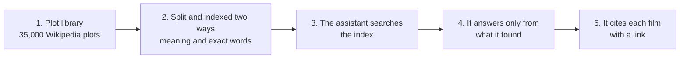

# Movie Plots RAG: solution overview

This page is for readers with no AI background. Terms in the glossary at the end are explained there.
Every result figure sits in a table copied from the project's evaluation report, [`reports/EVAL_RESULTS.md`](../reports/EVAL_RESULTS.md).
"Pending credentials" means a key (an access code for an outside service) is missing, not that the result is zero.

## 1. The problem

People remember films by their story, not their title. They say "the one where a window cleaner sees a murder through the glass".
Keyword search fails them, because a film's plot rarely uses their words.

This project finds the film from a rough description of its story. It shows where each answer comes from, so a reader can check it.

## 2. What it does

You type a question in plain words. The system looks for matching plots, then writes a short answer that names each film and links its Wikipedia page.

Worked example, run on the built-in sample library:

* **Question:** "a hotel telephone operator overhears a call arranging a death at midnight"
* **Films the search really returned, best first:** *The Overheard Midnight Call* (1968), then *The Whispered Call* (2017), then *The Empty Farmhouse Line* (1968).
* **Answer, as written for illustration:** "This sounds like *The Overheard Midnight Call* (1968). A hotel operator overhears a plan for a death at midnight." The answer ends with the film's Wikipedia link.

Two honest notes. The sample library holds invented films, so its Wikipedia links do not exist.
The answer sentence is hand-written to show the format. The first real model answer is pending credentials.

## 3. How it works in five steps

1. **Plot library.** We start from about 35,000 film plots taken from Wikipedia. For development we use 291 invented plots instead.
2. **Split and indexed two ways.** Long plots are cut into short passages. Each passage is stored by its meaning and by its exact words.
3. **The assistant searches.** It turns your question into searches and runs them, up to four per question.
4. **It answers only from what it found.** The rules forbid facts that the search did not return. If nothing fits, it says so.
5. **It cites each film.** Every film in the answer comes from the search results, with its year and Wikipedia link.

## 4. How we know it works

We wrote 40 test questions in four kinds. Some describe a story. Some name a film or a director.
Some add filters such as year or country. The last ten ask about films that do not exist.

We measure three things:

* How often is the right film among the first results?
* How often do answers stay true to their sources?
* How often does the system say "I don't know" when it should?

The first measure needs no key. The other two need the language model, so they are pending credentials.

<!-- BEGIN OVERVIEW QUALITY (generated by `make report` from reports/eval_<mode>.json; do not edit by hand) -->

Measured on the synthetic sample library (304 indexed passages, collection `movie_plots_eval`). 30 of the 40 questions have a known right film. The first two columns show how often the right film comes first, or among the first three (1.00 means always). The last two need the language model and stay pending until a key is set.

| Search method | Right film first | Right film in top 3 | Answers stay true to sources | Says "I don't know" when it should |
|---|---|---|---|---|
| Meaning (dense) | 0.77 | 0.77 | pending credentials | pending credentials |
| Exact words (sparse) | 0.97 | 1.00 | pending credentials | pending credentials |
| Both combined (hybrid) | 0.88 | 1.00 | pending credentials | pending credentials |

<!-- END OVERVIEW QUALITY -->

How to read this. The test library is small and built around rare invented words.
That favours exact-word search, so the ranking says little about real data. One question moves a score by several points.

## 5. Cost and speed

Search itself is fast, as the first table shows. The second table covers the full answer, which also needs the language model.

<!-- BEGIN OVERVIEW SPEED (generated by `make report` from reports/eval_<mode>.json; do not edit by hand) -->

| Search method | Search time, typical (ms) | Search time, slowest 5% (ms) |
|---|---|---|
| Meaning (dense) | 39 | 61 |
| Exact words (sparse) | 22 | 24 |
| Both combined (hybrid) | 40 | 62 |

| Measure | Meaning (dense) | Exact words (sparse) | Both combined (hybrid) |
|---|---|---|---|
| Seconds per answer (median) | pending credentials | pending credentials | pending credentials |
| Tokens per question (median) | pending credentials | pending credentials | pending credentials |

<!-- END OVERVIEW SPEED -->

Cost per 1,000 questions: pending credentials. It needs the token counts from a real run and the provider's price list.
Each answer is capped at four searches, which also caps its cost.

## 6. Limits

* English only, and Wikipedia plots only.
* No ratings, reviews or opinions. It cannot say whether a film is good.
* Weak on very short plots. Plots under 50 words are dropped, and short ones give little to match.
* Tested only on invented films so far. Real-data results are unknown.
* The model may still mention a film it did not retrieve. The citation list shows only retrieved films, but the answer text is not yet scrubbed.
* Cast names are not searchable.

## 7. How it was built

Software agents built it over two days, 9 and 10 October 2026, under automated checks.
A builder agent wrote each change. A separate reviewer agent then tested and reviewed it before acceptance.
Ten changes were merged. Three failed their first review (changes 1, 2 and 9), were fixed, and passed the second.
Every merged change has a written review report ending in a pass verdict.

The audit trail is in the repository:

* [`docs/PR_TRACKER.md`](PR_TRACKER.md) lists every change with its review result.
* [`docs/TOKEN_USAGE.md`](TOKEN_USAGE.md) lists each agent's work in "tokens", the units a language model reads and writes.

As of change 10, the tracker shows 22 agent runs. They processed about 158 million tokens, almost all re-read context.
The estimated cost was $57.09 at public list prices. This overview is change 11, so its own usage is added after merge.
More than 1,000 automated tests run on every change, and the code must keep at least 80% test coverage.

## 8. What's next

1. **Connect credentials and run the full evaluation.** About an hour of human work, plus run time. It fills every "pending credentials" cell. The steps are in [`docs/CREDENTIALS.md`](CREDENTIALS.md).
2. **Load the real 35,000-film library.** About an hour of human work, plus indexing time that has not been measured. The question set must then be regenerated.
3. **Fix the answer text and add a re-ranker.** Two to three days. Scrubbing invented titles removes the main known weakness. A re-ranker re-sorts the top results with a second model.

These effort figures are estimates, not measurements.

## 9. Glossary

* **RAG** (retrieval-augmented generation): the assistant first looks up passages, then writes its answer from them instead of from memory.
* **Embedding:** a list of numbers that captures what a passage means, so similar passages get similar numbers.
* **Vector database:** a store that finds the passages whose numbers are closest to the question's numbers. We use Qdrant.
* **Hybrid search:** meaning-based search and exact-word search run together, with their results merged into one ranking.
* **MCP** (Model Context Protocol): a standard way for an assistant to call outside tools. Here the tools are the film searches.
* **Evaluation:** measuring the system on fixed test questions with known right answers.
* **Language model:** the AI program that writes the answers. Here it runs on Nebius, an outside service.
* **Key (credentials):** a private access code for an outside service. Without one, the parts that need that service are skipped.
* **Faithfulness:** whether every claim in an answer is backed by the retrieved passages.
* **Abstention:** the system declining to answer ("I don't know") because nothing it found fits.
